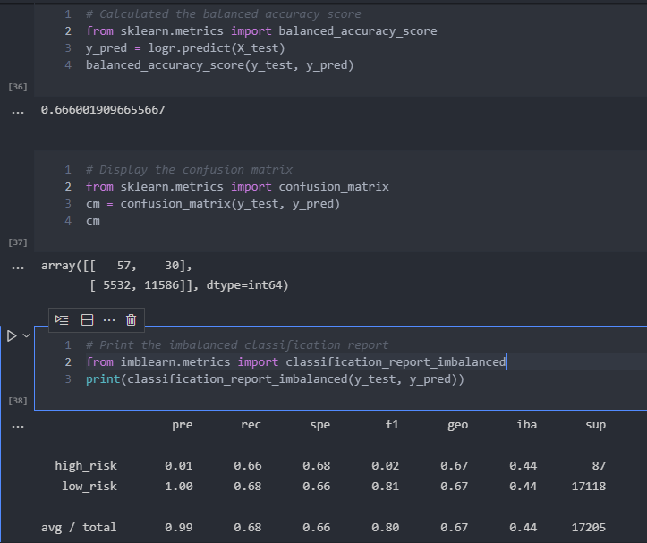
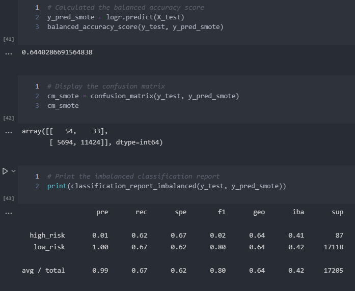
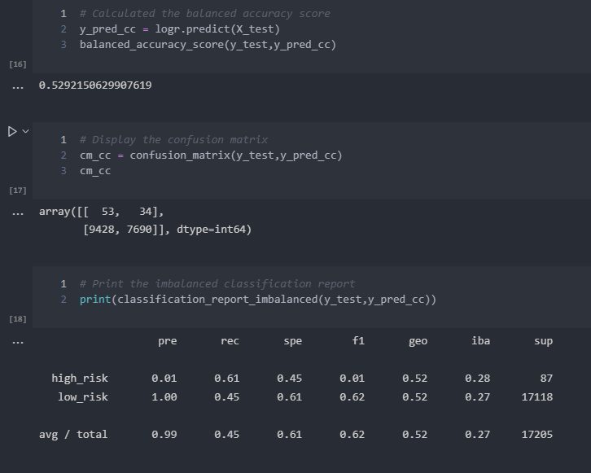
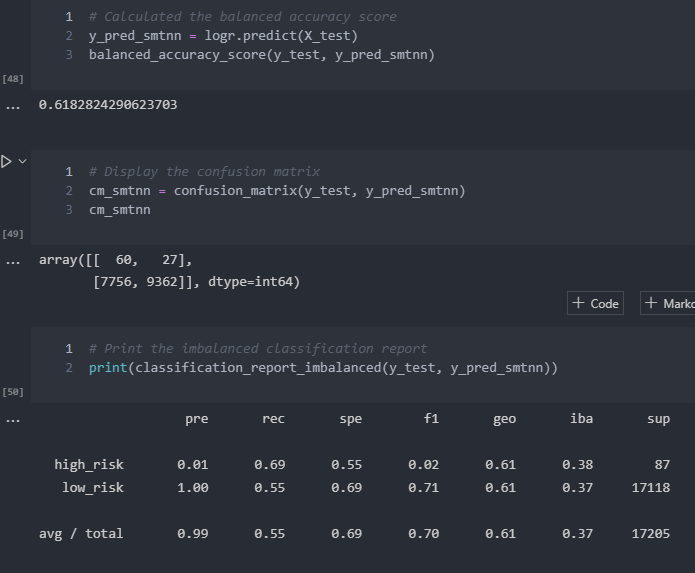
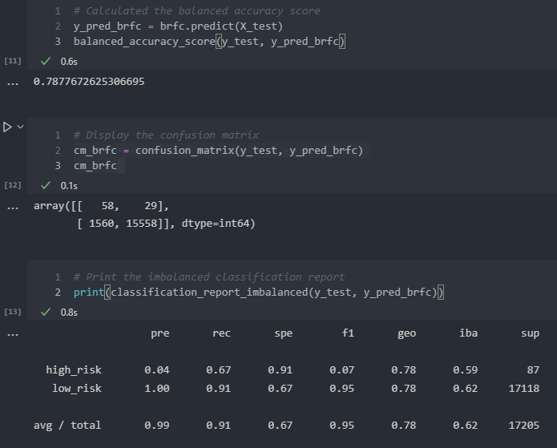
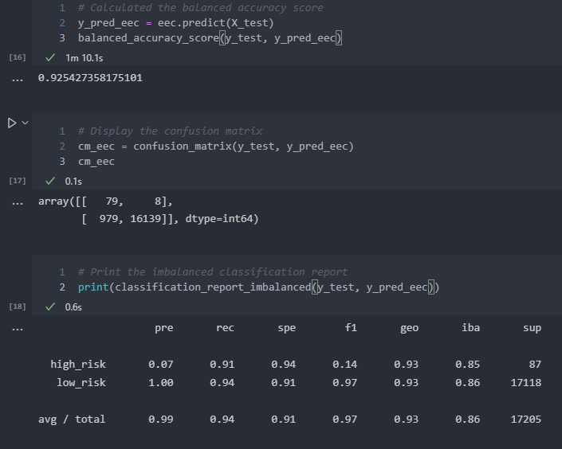

# Credit Risk Analysis

## Overview of the analysis

Credit risk is an unbalanced classification problem, since in most of the time, the number of good credit loans outnumber the number of risky or bad credit loans.

As an example, let’s consider a dataset of 100000 loan details. Out of these loans, there may be 100 risky loans, which means there are 99900 good loans. The difference between good and risky loans is very high.

As we can see, if we use normal machine learning algorithms directly to predict the outcomes, it will not give very accurate results because of the bias in the good and risky loan counts. That's why we need to perform resampling before applying the machine learning models. Also, the bias classifiers are helpful in such scenarios.

To analyze this classification problem, we can use machine learning approaches. In this analysis, we have used _logistic regression_ as our main machine learning algorithm with **RandomOverSampler**, **SMOTE**, **ClusterCentroids** and **SMOTEENN** resampling algorithms.

Also, we have used **BalancedRandomForestClassifier** and **EasyEnsembleClassifier** machine learning algorithms to classify data here.

For each of these cases, we have evaluated our prediction by computing following performance matrices.

- Balanced accuracy score
- Confusion matrix
- Imbalanced classification report

## Results

- ### Naive Random Oversampling

  - Balanced accuracy score : 0.666
  - Precision :
    - high_risk : 0.01
    - low_risk : 1.00
  - Recall score :
    - high_risk : 0.66
    - low_risk : 0.68

- ### SMOTE Oversampling

  - Balanced accuracy score : 0.644
  - Precision :
    - high_risk : 0.01
    - low_risk : 1.00
  - Recall score :
    - high_risk : 0.62
    - low_risk : 0.67

- ### Cluster Centroids algorithm

  - Balanced accuracy score : 0.529
  - Precision :
    - high_risk : 0.01
    - low_risk : 1.00
  - Recall score :
    - high_risk : 0.61
    - low_risk : 0.45

- ### SMOTEENN algorithm

  - Balanced accuracy score : 0.618
  - Precision :
    - high_risk : 0.01
    - low_risk : 1.00
  - Recall score :
    - high_risk : 0.69
    - low_risk : 0.55

- ### Balanced Random Forest Classifier

  - Balanced accuracy score : 0.788
  - Precision :
    - high_risk : 0.04
    - low_risk : 1.00
  - Recall score :
    - high_risk : 0.67
    - low_risk : 0.91

- ### Easy Ensemble AdaBoost Classifier

  - Balanced accuracy score : 0.925
  - Precision :
    - high_risk : 0.07
    - low_risk : 1.00
  - Recall score :
    - high_risk : 0.91
    - low_risk : 0.94

## Summary

Random Over Sampler, SMOTE, Cluster Centroids and SMOTEENN resampling algorithms have balanced accuracy scores less than 0.7 which are considerably low values. Balanced Random Forest Classifier has a little bit higher accuracy score compared to others, but it is not sufficient.

Also, the recall scores of them are also low except the low_risk recall score of Balanced Random Forest Classifier.

In other hand, Easy Ensemble Classifier has a good accuracy score, precision and recall scores. Therefore, we can recommend Easy Ensemble Classifier to analyze this credit risk problem.
